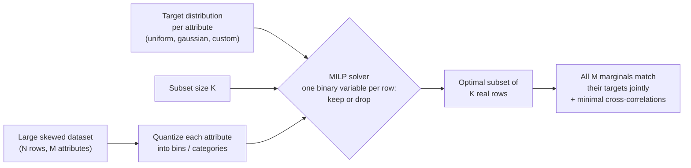

# datacarve

[](https://github.com/bbonik/datacarve/actions/workflows/ci.yml)
[](https://www.python.org/downloads/)
[](LICENSE)

**Carve a balanced subset out of a large dataset — distributional dataset undersampling via MILP optimization.**

```bash
pip install datacarve
```
```python
from datacarve import undersample_dataset

mask = undersample_dataset(data, data_to_keep=1000)  # balanced across ALL dimensions
subset = data[mask]
```

`datacarve` selects the **provably optimal subset** of a dataset whose attributes jointly follow the distributions you specify — balanced across gender *and* age *and* race *and* label, all at once. Typical uses: **fair evaluation sets** for bias audits and Responsible AI compliance, **LLM data mixtures** (eval suites, SFT subsets, red-teaming pools), quota samples, and matched cohorts. Under the hood it is a Mixed Integer Linear Programming (**MILP**) formulation that exploits the redundancies of a large dataset to carve a compact, distribution-shaped version of it, while also minimizing cross-attribute correlations. Formerly known as `distributional_dataset_undersampling`.


## The problem: your dataset is imbalanced in several ways at once

Real datasets are rarely skewed along just one attribute. Take the classic Adult census dataset (48,842 rows): **two-thirds male, 85% White, 76% low-income, ages bunched between 25 and 45** — four imbalances at the same time. Train or evaluate on it as-is, and your metrics are quietly dominated by the majority groups.

Fixing **one** attribute is easy: group by it, sample equally per group. Fixing **all of them at once** is a different kind of problem, and this is the part few people appreciate until they try:

- **Every row you keep counts toward every histogram simultaneously.** A row that improves your gender balance may worsen your age balance. There is no "safe" row to drop.
- **Stratifying on the combination of attributes explodes.** 2 sexes × 5 races × 2 income classes × 10 age bins = 200 strata — most of which are nearly or completely empty in the original data. You cannot sample equally from empty strata.
- **Greedy selection has no guarantee.** Picking whichever row locally improves balance routinely paints itself into corners where every remaining candidate makes some attribute worse.

Selecting the best possible subset under joint distributional constraints is a **combinatorial optimization problem**. Treating it like one — instead of approximating with heuristics — is the whole point of this package.

## How datacarve solves it

`datacarve` formulates the selection as a **Mixed Integer Linear Program (MILP)**: one binary keep/drop decision per row, constraints that tie the selected counts in every (attribute, bin) cell to your target distribution, and an objective that minimizes total deviation from the targets while also suppressing cross-attribute correlations.



The solver either **proves it found the optimal subset**, or — given a time budget — returns the best subset found with a quality bound. Three properties fall out of this that heuristics cannot offer:

1. **Exactness.** The selected counts per group are guaranteed, not approximate: you can state "200 rows per race, 500 per sex" in a datasheet and mean it.
2. **Jointness.** All attributes are satisfied *simultaneously* — numeric ones shaped to any distribution (uniform, gaussian, custom histogram), categorical ones to exact per-category counts.
3. **Real data only.** The subset is made of your actual rows. Nothing is synthesized, duplicated, or reweighted.

The technique is *complementary to dimensionality reduction*: instead of reducing feature dimensions while keeping all observations, it reduces observations while imposing distributional constraints on the dimensions.

The figure above shows it in action on a 6-dimensional dataset (11K datapoints), where dimension D5 is a linear combination of D0 and D3. Three 1K subsets are carved with Uniform, Gaussian and Triangular targets: every histogram takes the target shape, and the D0–D5 correlation visible in the original is broken in the subsets.

## Fairness and Responsible AI

This is the use case the package was built around, and it has only become more urgent since the original papers (ICIP 2016 / IEEE TMM 2017). Today, model cards, datasheets, bias audits, and regulations such as the **EU AI Act** all expect evidence that systems were evaluated on **representative, balanced data across sensitive attributes** — and "we randomly sampled and hoped" does not qualify.

`datacarve` turns that requirement into a one-liner with a provable result:

- **Balanced evaluation sets.** In a random 1,000-row sample of Adult, the smallest racial group gets ~8 rows — its accuracy estimate is statistical noise that swings on a couple of lucky predictions. A carved set gives *every* group the same 200-row evidence base, making per-group metrics comparable and equally trustworthy. See the [worked notebook](notebooks/balanced_evaluation_sets.ipynb): sex 500/500, race 5×200, income 500/500, age flat — simultaneously, in seconds.
- **Auditable by construction.** Because the constraints are explicit and the solver's result status is reported, the composition of your eval set is a *documented guarantee*, not a post-hoc observation — exactly what a datasheet or compliance review wants to see.
- **Realistic, not just uniform, targets.** Fairness rarely means "make everything equal". Per-attribute targets let you balance sensitive attributes exactly while keeping, say, a realistic 3:1 label ratio: `target_distribution=["uniform", "uniform", [3, 1]]`.

## Applications

Any situation where you need a **subset of fixed size whose attributes follow prescribed distributions, jointly across several attributes**, is a candidate.

### In the LLM era

Modern LLM work is largely *data curation under a budget* — which is exactly this problem. Attributes don't need to be raw columns: task labels, topic clusters from embeddings, difficulty scores, or length buckets all work.

- **Balanced benchmark & eval suites.** Carve an evaluation set that is balanced across task type × domain × difficulty × language × prompt length, so a model's headline score isn't dominated by whichever category the benchmark over-collected. Same for regression-testing suites that must stay small enough to run on every checkpoint.
- **Fine-tuning mixtures (SFT).** Instruction datasets skew heavily by source, topic and length. Carve a compact training subset that hits an exact target mixture (e.g. 30% coding, 30% reasoning, 20% writing, 20% multilingual — with a target length distribution) instead of eyeballing sampling ratios.
- **Safety & red-teaming sets.** Balance adversarial prompts across harm categories × attack styles × targeted demographics, so safety metrics cover the space instead of over-testing the most common attack type.
- **Human evaluation & preference data.** Annotator time is the scarcest resource in RLHF pipelines; carve the candidate pool so every scenario type gets equal annotation coverage.

### Classical ML and beyond

- **Dataset debiasing / data-centric AI.** Reshape a skewed training set toward a target distribution instead of collecting new data, leveraging redundancy already present in the dataset.
- **Causal inference & epidemiology.** Select a control cohort whose covariate distributions match a treatment group (or any reference population). This generalizes matching approaches such as cardinality matching: the target can be *any* distribution, not just another group's.
- **Survey statistics & market research.** Quota sampling and panel calibration: pick respondents so that the sample matches census demographics across several attributes simultaneously ([worked notebook](notebooks/survey_quota_sampling.ipynb)).
- **A/B testing.** Assign experiment groups that are balanced across multiple covariates, rather than relying on randomization alone for small samples.
- **Drug discovery / cheminformatics.** Select compound libraries with desired property distributions (molecular weight, logP, solubility, ...) while minimizing redundancy between correlated properties.
- **Simulation & testing.** Choose a representative, affordable subset of test scenarios (e.g., driving scenarios spanning weather × traffic × speed distributions) when running all of them is too expensive.

## How it compares to other approaches

| Approach | What it does | Limitation this method addresses |
|---|---|---|
| **Random / stratified sampling** | Samples uniformly, or balances strata of *one* attribute. | Cannot jointly balance several attributes; multi-attribute stratification explodes combinatorially and leaves many empty strata. |
| **Class balancing** (e.g., random undersampling, SMOTE in `imbalanced-learn`) | Balances a single categorical label, possibly by synthesizing points. | Single-label only; synthetic points may be unrealistic. This method handles multiple *continuous or categorical* dimensions and only ever selects real datapoints. |
| **Reweighting / calibration** (importance weights, raking) | Keeps all data but assigns weights so that weighted statistics match targets. | The dataset stays large and individual high-weight points dominate; many ML pipelines and human-evaluation settings need an *actual subset*, not weights. |
| **Matching methods** (propensity score, cardinality matching) | Selects a control group whose covariates match a treatment group. | Matches to *another sample's* distribution; here the target is arbitrary (uniform, gaussian, custom), and correlation between attributes is minimized explicitly. |
| **Coreset selection / data pruning** | Selects a subset that preserves model loss or gradient information. | Optimizes for a *model's* training objective, not for interpretable distributional guarantees; typically gives no control over per-attribute histograms. |
| **Greedy / heuristic subset selection** | Iteratively picks points that locally improve balance. | No global guarantee: a point that helps attribute A may hurt attribute B. The MILP reasons about all attributes and all points jointly, and returns a certified optimal (or bounded) solution. |

In short: this method occupies a niche none of the standard tools cover — **exact, jointly multi-attribute, distribution-targeted subset selection of real datapoints**. One binary decision variable per datapoint solves comfortably up to hundreds of thousands of rows on a laptop; for larger datasets the built-in [pre-reduction stage](#very-large-datasets) extends it to tens of millions.

## Installation

Requires Python 3.10+ (tested with Python 3.12).

```bash
pip install datacarve            # core (solver only)
pip install "datacarve[plot]"    # core + scatterplot matrices
```

Or from source:

```bash
git clone https://github.com/bbonik/datacarve.git
cd datacarve

# create and activate a virtual environment
python3 -m venv .venv
source .venv/bin/activate  # on Windows: .venv\Scripts\activate

pip install -e ".[plot]"
```

The MILP solver is [Google OR-Tools](https://developers.google.com/optimization) (CBC backend), which is installed automatically — no separate solver installation is needed.

## Quick start

```python
import numpy as np
from datacarve import undersample_dataset

rng = np.random.default_rng(0)
data = rng.random((5000, 4))  # [N observations, M dimensions]

mask = undersample_dataset(
    data=data,
    data_to_keep=500,            # size of the undersampled subset
    target_distribution="uniform",  # 'uniform', 'gaussian', 'weibull', 'triangular'
    bins=10,                     # quantization bins per dimension
    lamda=0.5,                   # weight of the correlation-minimization objective
)

subset = data[mask]  # boolean mask over the original observations
```

You can also pass a **custom target distribution** as an array of bin weights (one weight per bin, automatically normalized):

```python
# triangular-ish custom target over 10 bins
mask = undersample_dataset(
    data=data,
    data_to_keep=500,
    target_distribution=[1, 2, 3, 4, 5, 5, 4, 3, 2, 1],
    bins=10,
)
```

Useful options:

| Parameter | Default | Description |
|---|---|---|
| `data_to_keep` | `1000` | Number of datapoints to keep. |
| `data_scaling` | `'minmax'` | Per-feature scaling to [0, 1]. Use `None` if the data is already scaled. |
| `target_distribution` | `'uniform'` | Built-in name, a custom array of bin weights, or a list with one spec per dimension. See [Per-dimension targets](#per-dimension-targets-and-categorical-attributes). |
| `bins` | `10` | Quantization bins per numeric dimension. Categorical dimensions use one bin per unique value. |
| `categorical_dims` | `None` | Column indices to treat as categorical (one bin per unique value). |
| `lamda` | `0.5` | Balance between distribution matching (`0`) and correlation minimization (`>0`). |
| `prereduce` | `None` | Pre-reduce huge datasets before solving: `'auto'`, or an int cap per joint cell. See [Very large datasets](#very-large-datasets). |
| `solver` | `'CBC'` | MILP solver backend: `'CBC'`, `'SCIP'`, or `'SAT'`. See [Choosing a solver](#choosing-a-solver). |
| `max_solver_time_sec` | `10.0` | Time budget for the MILP solver. Increase for large datasets. |
| `verbose` | `True` | Print progress and solver statistics. |
| `scatterplot_matrix` | `'auto'` | Show scatterplot matrices (auto-disabled for >10 dimensions). |

## Per-dimension targets and categorical attributes

Each dimension can get its **own target distribution** — pass a list with one spec per dimension, mixing built-in names and custom weight arrays:

```python
mask = undersample_dataset(
    data=data,  # shape (N, 3)
    data_to_keep=500,
    target_distribution=["uniform", "gaussian", [1, 2, 3, 4, 5, 5, 4, 3, 2, 1]],
)
```

**Categorical attributes** (e.g. gender, race, class labels) should not be quantized into equal-width bins. Mark them with `categorical_dims` and each unique value becomes its own bin, so `'uniform'` means "equal counts per category":

```python
# column 2 holds a label-encoded category (e.g. 0=A, 1=B, 2=C)
mask = undersample_dataset(
    data=data,
    data_to_keep=300,
    target_distribution=["uniform", "uniform", [3, 2, 1]],  # 3:2:1 over categories
    categorical_dims=[2],
)
```

This is the typical recipe for fairness-style curation: balance the categorical attributes exactly (equal counts per gender/race/label) while shaping the continuous attributes (age, pose, brightness) to a target distribution — all jointly, in one optimization.

## Very large datasets

The MILP uses one binary variable per row, which is comfortable up to several hundred thousand rows. Beyond that, use the built-in **pre-reduction** stage:

```python
mask = undersample_dataset(
    data=huge_data,        # e.g. 10 million rows
    data_to_keep=1000,
    prereduce="auto",      # or an explicit per-cell cap, e.g. prereduce=50
)
```

Pre-reduction groups rows by their joint quantization cell (the combination of bin indices across all attributes). Rows in the same cell are interchangeable with respect to every histogram constraint, so overcrowded cells are randomly downsampled to a cap while **rare cells are always kept in full** — unlike naive random subsampling, which preserves the skew you are trying to fix and can wipe out rare categories entirely. With `'auto'`, the cap is chosen adaptively so the reduced pool stays at a size the solver handles in seconds. The returned mask always refers to the original rows.

Measured on a laptop: a 10-million-row dataset is carved into a perfectly balanced 1,000-row subset (proven optimal) in about 10 seconds end-to-end.

The standalone `prereduce_dataset()` function exposes the same stage with control over the cap, grouping granularity, and random seed.

## Choosing a solver

All three backends are free, open source, and bundled with OR-Tools — no extra installation needed. They solve the exact same model; they differ in *how* they search, which matters once problems get hard.

| Solver | Best for | Character |
|---|---|---|
| `'CBC'` (default) | Easy to moderate problems | Classic branch-and-bound. Fastest when the problem is not too constrained; if it reports `optimal` within the time budget, stay with it. |
| `'SAT'` (CP-SAT) | Hard instances that hit the time limit | Clause-learning search, multi-core. When the status is `feasible` (time ran out before optimality was proven), it typically finds noticeably *better* subsets than CBC in the same time budget. |
| `'SCIP'` | Medium-hard instances | Modern branch-and-cut. Worth trying when CBC finds a solution quickly but struggles to prove it optimal. |

**Rule of thumb:**

1. Start with the default (`'CBC'`).
2. Check the reported result status (printed when `verbose=True`).
3. If the status is `optimal` — done, no reason to switch.
4. If the status is `feasible` (the time budget ran out), re-run with `solver='SAT'` and/or a larger `max_solver_time_sec`. This is where CP-SAT shines: on a hard 11K-point benchmark instance, all solvers hit a 60s budget, but CP-SAT returned the best subset found.
5. If no solution is found at all, the constraints may be too tight for your data: increase `max_solver_time_sec`, reduce `bins`, or reduce `data_to_keep`.

What makes an instance "hard"? More datapoints, more dimensions, strongly imbalanced data relative to the target (little redundancy to exploit), and correlated dimensions all increase difficulty.

## Examples

Two executed walkthrough notebooks in [`notebooks/`](notebooks/):

- **[Building fair, balanced evaluation sets](notebooks/balanced_evaluation_sets.ipynb)** — carves a 1,000-row eval set from the Adult census data, balanced across sex, race, income and age *simultaneously*, and shows why per-group accuracy numbers become trustworthy.
- **[Survey quota sampling](notebooks/survey_quota_sampling.ipynb)** — selects a quota sample from a skewed respondent panel, hitting census-style age/gender/region targets exactly (fully offline, synthetic data).

Runnable scripts in the [`examples/`](examples/) folder:

- **`example_6d_dataset.py`** — undersamples the bundled 6-dimensional dataset (11K datapoints) down to a uniform 1K subset.
- **`example_random_data.py`** — generates a random N-dimensional dataset (a different random distribution per dimension) and undersamples it.
- **`example_sklearn_datasets.py`** — applies the technique to classic scikit-learn datasets (diabetes, iris, breast cancer). Requires `scikit-learn`.

```bash
python examples/example_6d_dataset.py
```

Solver benchmarks live in [`benchmarks/`](benchmarks/).

## Citations

If you use this code in your research please cite the following papers:

1. [Vonikakis, V., Subramanian, R., Arnfred, J., & Winkler, S. A Probabilistic Approach to People-Centric Photo Selection and Sequencing. IEEE Transactions in Multimedia, 11(19), pp.2609-2624, 2017.](https://www.researchgate.net/publication/316569587_A_Probabilistic_Approach_to_People-Centric_Photo_Selection_and_Sequencing)
2. [V. Vonikakis, R. Subramanian, S. Winkler. Shaping Datasets: Optimal Data Selection for Specific Target Distributions. Proc. ICIP2016, Phoenix, USA, Sept. 25-28, 2016.](http://vintage.winklerbros.net/Publications/icip2016a.pdf)
