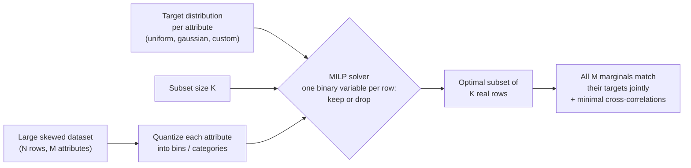

# Building fair evaluation sets is a combinatorial problem. Here's how to solve it exactly.

*Revised edition — expands the statistical caveats, prior art, and preconditions following reader feedback. The originally published version is [on Medium](https://medium.com/@bbonik/building-fair-evaluation-sets-is-a-combinatorial-problem-heres-how-to-solve-it-exactly-539b7df183f7).*

Overall accuracy is a weighted average — and the weights are whatever your evaluation set happens to contain. If your eval set is 90% group A and 10% group B, a model scoring 95% on A but only **60% on B** still reports a comfortable **91.5% overall**:


The failure is sitting in plain sight, absorbed into a healthy-looking headline number. And checking group B's number on the same skewed set doesn't rescue you: it rests on a handful of rows, so its estimate is far noisier than group A's. This is not hypothetical — commercial face-analysis systems shipped with error rates roughly 10× higher for dark-skinned women than for light-skinned men, and the gap went unnoticed for years because the benchmarks were overwhelmingly light-skinned and male. The model and the measuring instrument shared the same blind spot.

The fix is an evaluation set where every group has **equal statistical footing**. Now, one precondition before anything else — because it decides whether you need this post at all. **If your entire pool is already labeled and evaluation is free, you don't need a subset: evaluate on everything and report per-group numbers.** But real evaluation is rarely free. Human review, expert annotation, judge-model API calls, latency budgets, suites that must re-run on every checkpoint — in most modern pipelines, especially LLM ones, evaluation capacity is the binding constraint. The operating assumption of this post is exactly that: **you can afford K evaluations, and the question is which K rows to spend them on.** Choose them randomly and the skew above is what you get; no weighting scheme applied afterwards can create evidence you never collected.

Building a subset that is balanced across several attributes at the same time turns out to be a genuinely hard combinatorial problem that most teams solve with duct tape. Let me show you the problem, what the honest alternatives are, and a small open-source package that solves it exactly.

## The problem: your dataset is imbalanced in several ways at once

Take the classic [Adult census dataset](https://archive.ics.uci.edu/dataset/2/adult) (also on [OpenML](https://www.openml.org/d/1590), which is what the code below loads): 48,842 rows. Two-thirds male. 85% White. 76% low-income. Age bunched between 25 and 45.

One honest framing note: Adult ships fully labeled, so treat it here as a stand-in for a budget-constrained pool — pretend each row you evaluate still costs you something, as it would in a human-eval or judge-based pipeline. (For a case where the budget constraint is real rather than simulated, see the [LLM eval-suite notebook](https://github.com/bbonik/datacarve/blob/master/notebooks/llm_eval_suite.ipynb): 15K instruction prompts, of which you can afford to run 500 through evaluation.)

Suppose your budget is 1,000 evaluations, and you want that eval set to be *simultaneously*:

- 50/50 on sex,
- equal across all five race categories,
- 50/50 on income class,
- flat across the age range.

Balancing any **one** of these is trivial — group by the attribute, sample equally per group. But every row you pick counts toward **four histograms at once**. A row that helps your sex balance might wreck your age balance. Stratifying on the cross-product of all four attributes doesn't work either: 2 sexes × 5 races × 2 incomes × 10 age bins = 200 strata, most of which are nearly empty in the original data (how many rows do you think there are of high-income Amer-Indian-Eskimo women over 70?).

Greedy selection — iteratively picking whichever row locally improves balance — has no guarantee at all. It routinely paints itself into corners where every remaining candidate makes some marginal worse.

This is a combinatorial optimization problem. So let's treat it like one.

## Selection as integer programming

The whole pipeline fits in one picture:



The formulation is almost embarrassingly clean. For each row *k*, introduce a binary variable *x_k* ∈ {0, 1}: keep it or not. Then:

- **one constraint** fixes the subset size: Σ *x_k* = 1000;
- for every (attribute, bin) cell, a **slack variable** measures how far the selected count in that cell deviates from its target count;
- the **objective** minimizes the total slack (plus, optionally, a term that suppresses cross-attribute correlations in the selected subset).

Minimize deviation from all target histograms jointly, over all possible 1,000-row subsets. A mixed integer linear programming (MILP) solver either proves it found the optimal subset or, given a time budget, returns the best one found with a quality bound. One precision on the word "exactly": the optimization is exact *with respect to this objective* — total L1 deviation on the marginals. That objective is a modeling choice (a different deviation measure would prefer different subsets), and I'll come back to what that does and doesn't buy you.

I published this formulation back in 2016 ([ICIP paper](http://vintage.winklerbros.net/Publications/icip2016a.pdf)); we used it to curate balanced face datasets. The fairness conversation has since made the problem mainstream, so I've modernized the implementation and packaged it: [**datacarve**](https://github.com/bbonik/datacarve). The name means what it does: to *carve* is to **undersample** — select a subset of your real rows and drop the rest, so that what remains has exactly the shape you asked for.

```bash
pip install datacarve
```

## Three seconds later

Here's the entire Adult example. Categorical columns are label-encoded and flagged; `'uniform'` means "equal counts per category" for categorical attributes and "flat histogram" for numeric ones:

```python
import numpy as np
from datacarve import undersample_dataset

# age, sex_codes, race_codes, income_codes: label-encoded columns of your DataFrame df
data = np.column_stack([age, sex_codes, race_codes, income_codes])

mask = undersample_dataset(
    data=data,
    data_to_keep=1000,
    target_distribution="uniform",
    categorical_dims=[1, 2, 3],   # sex, race, income
)
balanced = df[mask]               # the mask indexes the original rows
```

On my laptop this solves in under three seconds, over 48,842 binary decisions. The result:


*Top row: the original dataset's skew. Bottom row: the carved 1,000-row subset — every marginal flat, simultaneously.*

| Attribute | Original (48,842 rows) | Carved subset (1,000 rows) |
|---|---|---|
| Sex | 67% / 33% | **500 / 500** |
| Race | 85% White ... 0.8% Other | **200 / 200 / 200 / 200 / 200** |
| Income | 76% / 24% | **500 / 500** |
| Age | bunched 25–45 | **~100 per decade bin** |

Carving is pure undersampling: every row in the subset is a real census record — nothing synthesized, duplicated, or reweighted. And the payoff under our budget assumption is immediate: a *random* 1,000-row eval set gives the smallest racial groups about 8 rows each, so their accuracy estimates swing by whole percentage points on a couple of lucky predictions. The carved set gives every group the same 200-row evidence base.

**Why evaluation specifically, and not just training on a balanced subset?** Because training and evaluation have opposite economics. In training, more data generally helps — models tolerate imbalance, loss weighting exists, and throwing rows away usually costs accuracy. Evaluation is a *measurement instrument*: it's small by necessity, which means per-group sample sizes collapse fast, and a skewed instrument gives readings dominated by the majority no matter how good the model is. You *can* compare groups with unequal n — standard two-proportion tests handle it — but the comparison inherits the precision of the worst-measured group; equalizing the evidence makes per-group estimates comparably precise, which is the property you actually want from an instrument. And under a fixed evaluation budget, carving costs you nothing you could have afforded to keep anyway.

**How large should each group's count be?** Balance is necessary, not sufficient — 200 rows per group still carries binomial noise. A quick rule of thumb at accuracies around 90%: with n rows per group, gaps smaller than roughly `6 / sqrt(n/200)` percentage points won't reliably clear a two-group significance test (at n=200 that's gaps below ~6 points; quadruple the group size to halve it, and add margin if you'll compare many groups at once). Decide the smallest gap you care about first, then size K — datacarve controls the composition; the power arithmetic is still yours to do.

Targets don't have to be uniform, and each attribute can get its own. Want to keep a realistic 3:1 income ratio while balancing everything else, and shape age like a gaussian? One list:

```python
target_distribution=["gaussian", "uniform", "uniform", [3, 1]]
```

The solver hit that 3:1 ratio at exactly 750/250.

## "Why not just...?"

The alternatives all solve a neighboring problem — and two of them deserve more credit than a dismissal:

- **Macro-averaging** (equal weight per group, computed on the skewed set) is the most tempting shortcut, and for a single categorical attribute on a fully labeled pool it's legitimately fine. But it fixes the *weighting*, not the *evidence*: under an evaluation budget of K rows, your smallest groups still contribute a handful of noisy rows — and equal weighting *amplifies* that noise rather than hiding it. It also composes poorly across several attributes (per-attribute averages confound each other), and it yields a metric definition, not a shippable dataset. In one line: **reweighting changes how you average the evidence; carving changes which evidence you collect.**
- **Balanced sampling — the cube method** ([Deville & Tillé 2004](https://doi.org/10.1093/biomet/91.4.893)) — is the strongest alternative and the right tool when statistical inference is your priority. It draws *probability* samples that satisfy balance constraints, with known inclusion probabilities, so classical survey estimators and confidence intervals remain valid — something carving cannot offer (see the limitations below). The trade: it balances totals of auxiliary variables approximately (its "landing phase" relaxes constraints that can't be met exactly) rather than shaping full per-attribute histograms to arbitrary targets, and it has no notion of suppressing cross-attribute correlation. If you need design-based inference more than exact composition, use the cube method; if you need a fixed-size set with a guaranteed, documented shape, carve.
- **Matching methods** from causal inference are closer relatives than they first appear: cardinality matching with *fine balance* (Zubizarreta and colleagues) is also an integer program constraining marginal distributions, and *template matching* can even target an external template rather than another sample. datacarve differs in being target-first and general-purpose: any parametric or custom target shape per attribute, mixed numeric/categorical dimensions, an explicit correlation-minimization objective, and a pip-installable API rather than a study design.
- **Stratified sampling** balances one attribute; the multi-attribute cross-product explodes into empty strata.
- **Class balancing tools** (undersampling/SMOTE in `imbalanced-learn`) handle a single label, and SMOTE fabricates synthetic points — fine for training, unacceptable for evaluation data.
- **Coreset selection** optimizes a model's training loss, with no interpretable guarantees on per-attribute histograms.

The niche datacarve fills: **jointly multi-attribute, distribution-targeted selection of real datapoints, optimal with respect to an explicit and auditable objective.**

## What carving does *not* give you

Honesty section — three limitations you should understand before trusting numbers from a carved set.

**1. Within-group selection bias, and no classical confidence intervals.** The 200 White rows the solver keeps are not a random sample of White rows: they were chosen *conditional on* what makes the age, sex and income histograms flat, so the retained subsample is tilted toward whatever cells the joint constraints needed. On top of that, the optimum is massively degenerate — many subsets achieve the same objective — and the solver breaks ties deterministically, by internals rather than by chance. There are no inclusion probabilities, hence no design-based confidence intervals. Practical guidance: datacarve's `randomize` parameter addresses the tie-breaking half of this — the solver keeps deciding *how many* rows per cell, but *which* rows fill each quota is drawn at random, so the selection is random conditional on the constrained attributes and the arbitrary-wander effect collapses ([measured here](https://github.com/bbonik/datacarve/blob/master/notebooks/hybrid_randomized_carving.ipynb)). The constraint-induced tilt itself remains (it must — it's the balance you asked for), so treat per-group metrics as estimates *conditional on the composition you imposed*; and if fully design-based frequentist inference is a hard requirement, that's the cube method's home turf (above).

**2. Marginal balance is not joint balance.** The constraints shape each attribute's histogram; they don't populate the cross-product. A set with flat sex and income marginals can still have most of its high-income rows be male. The correlation-suppression term in the objective pushes against linear dependence between attributes, but it's a soft objective, not a guarantee — inspect the joint composition of your carve for the pairs you care about.

**3. The knobs are modeling choices.** Binning matters: 10 vs 20 age bins prefer different subsets, and a "uniform" target over a sparse tail deliberately over-weights rare extremes (sometimes that's exactly what you want for stress-testing; sometimes it isn't). The L1-slack objective is one reasonable deviation measure among several. None of this is hidden — the constraints and targets are explicit, which is what makes the result auditable — but "provably optimal" always means "for the problem as you posed it."

One more boundary worth stating plainly, because the face-analysis story invites the misreading: **carving cannot fix a collection failure.** The subset is bounded by what the pool contains — if your pool holds 30 images of dark-skinned women, no selection method yields 200, and the actual fix for Gender Shades was collecting a *new*, balanced dataset. What carving adds in that situation is diagnosis: an infeasible target or a large residual slack is an explicit, quantified statement that your pool cannot support the evaluation you want — knowledge most teams currently acquire only after shipping.

## How far does it scale — and how exactly does it break?

"One binary variable per row" sounds like it should die at modest sizes. I assumed so too, so I measured it. On a laptop (CBC backend, 4–6 attributes, uniform targets, keeping ~10% of rows):

| Rows (N) | Build + solve | Status |
|---|---|---|
| 10,000 | 0.2 s | optimal |
| 100,000 | ~4 s | optimal |
| 400,000 | ~12 s | optimal |
| **1,000,000** | **~29 s** | **optimal, proven** |


A million rows, solved to *proven optimality*, in half a minute. There's a principled reason this isn't as surprising as it looks: each attribute's bin-count constraints have a simple, nearly network-like structure, and LP relaxations of such structures tend to land on solutions that are already close to integral — leaving branch-and-bound very little work. The same lens predicts the pathological case.

**The catch is structure, not size.** Look at the red X in the plot: an 11,000-row dataset — 90× smaller than the million-row instance — that still isn't solved optimally after 60 seconds. What makes it pathological is a dimension that's a near-linear combination of two others: it couples constraint blocks that were previously independent, the relaxation stops being informative, and the solver has to actually search. Difficulty grows with:

- **correlated or duplicated attributes** (the killer, as above);
- **targets that demand mass where the data barely has any** — asking for 100 rows in a bin that contains 103 candidates leaves the solver no slack;
- more attributes and finer bins (more coupled constraints);
- keep-ratios near the feasibility edge.

**And here is the important part: "breaking" is graceful.** The solver never crashes or returns garbage — it returns the *best subset found within the time budget* and tells you so via its status: `optimal` means proven best, `feasible` means "best found so far, ran out of time". In practice feasible solutions from a 60-second budget are already excellent; you're losing certainty, not quality. The escalation path when you see `feasible`: raise the time budget, and switch the `solver` parameter to `'SAT'` (on that pathological dataset, at the same 60-second budget, CP-SAT returned a better subset than both CBC and SCIP).

**So when should a researcher reach for datacarve?** Whenever the deliverable is a subset of hundreds to tens of thousands of rows drawn from a pool of up to about a million — evaluation sets, quota samples, matched cohorts, scenario suites. That covers nearly every curation task I've encountered; you rarely want a *balanced eval set* with ten million rows.

**If your pool really is tens of millions of rows**, don't reach for a naive random subsample — random sampling preserves the skew you're trying to fix and can annihilate rare groups entirely (a 0.1% category has ~100 rows in 100K samples... and 0 slack to spare). datacarve ships the correct pre-reduction built in:

```python
mask = undersample_dataset(huge_data, data_to_keep=1000, prereduce="auto")
```

It groups rows by their joint bin signature — rows sharing a signature are interchangeable with respect to every histogram constraint — then **keeps rare cells in full** and randomly downsamples only the overcrowded ones, with the cap chosen adaptively. The pre-reduction does the cheap volume work; the MILP does the precise joint shaping that the pre-reduction can't.

Measured end-to-end: **10,000,000 rows → a perfectly balanced 1,000-row subset (100 per bin on every attribute, proven optimal) in about 10 seconds** on a laptop.

## This is a Responsible AI tool, not just a sampling trick

One property of the MILP approach deserves emphasis in the current regulatory climate: the result is **auditable by construction**. Model cards, datasheets, and bias audits expect evidence about how evaluation data was composed. With heuristic sampling, the composition of your eval set is a post-hoc observation ("it happened to come out roughly balanced"). With datacarve, it's a *documented guarantee*: the constraints are explicit, the solver reports whether they were met optimally, and you can state "exactly 200 rows per group" in a datasheet and mean it.

One nuance worth being precise about, because it's a real tension rather than a slogan: regulation such as the EU AI Act (Article 10) asks for datasets that are "relevant" and "sufficiently representative" of the intended deployment context — and a uniformly balanced set is deliberately *not* representative of a skewed deployment population. These answer different questions: the **representative** set estimates aggregate performance in production; the **balanced** set makes per-group comparisons equally precise. A defensible evaluation practice ships both, with disaggregated reporting — and note that carving builds the representative one too: set the target distribution to the deployment distribution instead of uniform. The point is not "uniform everywhere"; it's *chosen, documented composition* instead of accidental composition.

## Where this fits in the LLM era

Modern LLM work is largely *data curation under a budget* — which is exactly this problem. The key realization: attributes don't need to be raw columns. Task labels, topic clusters from embeddings, difficulty scores, length buckets, or safety categories all work as dimensions to balance over.

- **Balanced benchmark & eval suites.** Carve an evaluation set balanced across task type × domain × difficulty × prompt length, so a model's headline score isn't dominated by whichever category the benchmark over-collected — and small enough to run on every checkpoint. ([Worked notebook](https://github.com/bbonik/datacarve/blob/master/notebooks/llm_eval_suite.ipynb): a 500-prompt suite carved from dolly-15k, balanced across task category × derived topic cluster × prompt length.)
- **Fine-tuning mixtures (SFT).** Instruction datasets skew heavily by source, topic and length. Carve a training subset that hits an exact target mixture (30% coding, 30% reasoning, 20% writing, 20% multilingual, with a target length distribution) instead of eyeballing sampling ratios.
- **Safety & red-teaming sets.** Balance adversarial prompts across harm categories × attack styles × targeted demographics, so safety metrics cover the space instead of over-testing the most common attack type.
- **Human evaluation & preference data.** Annotator time is the scarcest resource in RLHF pipelines; carve the candidate pool so every scenario type gets equal annotation coverage.

## Beyond machine learning

The same one-call recipe covers any "pick K items matching target distributions" problem:

- **Survey quota sampling**: carve a respondent sample hitting census age/gender/region quotas exactly (there's a [fully worked notebook](https://github.com/bbonik/datacarve/blob/master/notebooks/survey_quota_sampling.ipynb) — gender 750/750, region shares exact). For probability-sample quotas with valid inference, see the cube method above.
- **Cohort matching** in observational studies: covariate distributions matched to a treatment group, or to any reference population.
- **Compound library selection** in cheminformatics: desired property distributions, minimal redundancy between correlated properties.
- **Test scenario selection**: a representative, affordable subset of simulation conditions (weather × traffic × speed).

## Try it

```bash
pip install datacarve
```

- PyPI: <https://pypi.org/project/datacarve/>
- Repo: <https://github.com/bbonik/datacarve>
- Fairness notebook: [balanced_evaluation_sets.ipynb](https://github.com/bbonik/datacarve/blob/master/notebooks/balanced_evaluation_sets.ipynb)
- Solvers: three free, bundled backends (CBC, SCIP, CP-SAT) with guidance on when to use which — no license fees, nothing extra to install.

If you use it in research, the repo has a "Cite this repository" button (papers: IEEE TMM 2017, ICIP 2016).

I'd genuinely like to hear what you point it at — issues and PRs welcome.

---

*If you use datacarve in research, please cite the papers behind it: [Shaping Datasets: Optimal Data Selection for Specific Target Distributions (ICIP 2016)](http://vintage.winklerbros.net/Publications/icip2016a.pdf) and [A Probabilistic Approach to People-Centric Photo Selection and Sequencing (IEEE TMM 2017)](https://www.researchgate.net/publication/316569587_A_Probabilistic_Approach_to_People-Centric_Photo_Selection_and_Sequencing).*
