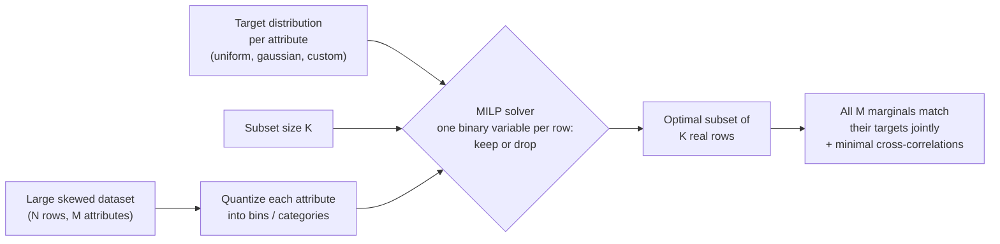

# Building fair evaluation sets is a combinatorial problem. Here's how to solve it exactly.

Overall accuracy is a weighted average — and the weights are whatever your evaluation set happens to contain. If your eval set is 90% group A and 10% group B, a model scoring 95% on A but only **60% on B** still reports a comfortable **91.5% overall**:


The failure is sitting in plain sight, diluted into a rounding error. And checking group B's number on the same skewed set doesn't rescue you: it rests on a handful of rows, so it's mostly noise. This is not hypothetical — commercial face-analysis systems shipped with error rates roughly 10× higher for dark-skinned women than for light-skinned men, and the gap went unnoticed for years because the benchmarks were overwhelmingly light-skinned and male. The model and the measuring instrument shared the same blind spot.

The fix is an evaluation set where every group has **equal statistical footing**. Building one — balanced across several attributes at the same time — turns out to be a genuinely hard combinatorial problem that most teams solve with duct tape.

If you're thinking *"just macro-average — equal weight per group, no new dataset needed"*: that fixes the arithmetic, not the evidence. **Evaluation is rarely free** — annotation budgets, human evals, judge-model costs, runs on every checkpoint — so in practice you choose *which* K rows to evaluate, and no weighting scheme can create evidence you never collected. Weighting also gets murky with several attributes at once (their effects confound each other), with continuous attributes like age, and whenever the deliverable is an actual dataset — a benchmark release, a human-eval panel, a datasheet. More on this in "Why not just...?" below.

Let me show you the problem, why the usual tools don't solve it, and a small open-source package that solves it exactly.

## The problem nobody's stratified sampler can handle

Take the classic [Adult census dataset](https://archive.ics.uci.edu/dataset/2/adult) (also on [OpenML](https://www.openml.org/d/1590), which is what the code below loads): 48,842 rows. Two-thirds male. 85% White. 76% low-income. Age bunched between 25 and 45.

Suppose you want a 1,000-row evaluation set that is *simultaneously*:

- 50/50 on sex,
- equal across all five race categories,
- 50/50 on income class,
- flat across the age range.

Balancing any **one** of these is trivial — group by the attribute, sample equally per group. But every row you pick counts toward **four histograms at once**. A row that helps your sex balance might wreck your age balance. Stratifying on the cross-product of all four attributes doesn't work either: 2 sexes × 5 races × 2 incomes × 10 age bins = 200 strata, most of which are nearly empty in the original data (how many rows do you think there are of high-income Amer-Indian-Eskimo women over 70?).

Greedy selection — iteratively picking whichever row locally improves balance — has no guarantee at all. It routinely paints itself into corners where every remaining candidate makes some marginal worse.

This is a combinatorial optimization problem. So let's treat it like one.

## Selection as integer programming

The whole pipeline fits in one picture:



The formulation is almost embarrassingly clean. For each row *k*, introduce a binary variable *x_k* ∈ {0, 1}: keep it or not. Then:

- **one constraint** fixes the subset size: Σ *x_k* = 1000;
- for every (attribute, bin) cell, a **slack variable** measures how far the selected count in that cell deviates from its target count;
- the **objective** minimizes the total slack (plus, optionally, a term that suppresses cross-attribute correlations in the selected subset).

Minimize deviation from all target histograms jointly, over all possible 1,000-row subsets, exactly. A mixed integer linear programming (MILP) solver either proves it found the optimal subset or, given a time budget, returns the best one found with a quality bound.

I published this formulation back in 2016 ([ICIP paper](http://vintage.winklerbros.net/Publications/icip2016a.pdf)); we used it to curate balanced face datasets. The fairness conversation has since made the problem mainstream, so I've modernized the implementation and packaged it: [**datacarve**](https://github.com/bbonik/datacarve). The name means what it does: to *carve* is to **undersample** — select a subset of your real rows and drop the rest, so that what remains has exactly the shape you asked for.

```bash
pip install datacarve
```

## Three seconds later

Here's the entire Adult example. Categorical columns are label-encoded and flagged; `'uniform'` means "equal counts per category" for categorical attributes and "flat histogram" for numeric ones:

```python
import numpy as np
from datacarve import undersample_dataset

# age, sex_codes, race_codes, income_codes: label-encoded columns of your DataFrame df
data = np.column_stack([age, sex_codes, race_codes, income_codes])

mask = undersample_dataset(
    data=data,
    data_to_keep=1000,
    target_distribution="uniform",
    categorical_dims=[1, 2, 3],   # sex, race, income
)
balanced = df[mask]               # the mask indexes the original rows
```

On my laptop this solves in under three seconds, over 48,842 binary decisions. The result:


*Top row: the original dataset's skew. Bottom row: the carved 1,000-row subset — every marginal flat, simultaneously.*

| Attribute | Original (48,842 rows) | Carved subset (1,000 rows) |
|---|---|---|
| Sex | 67% / 33% | **500 / 500** |
| Race | 85% White ... 0.8% Other | **200 / 200 / 200 / 200 / 200** |
| Income | 76% / 24% | **500 / 500** |
| Age | bunched 25–45 | **~100 per decade bin** |

Carving is pure undersampling: every row in the subset is a real census record — nothing synthesized, duplicated, or reweighted. And the practical payoff shows up immediately in evaluation: in a *random* 1,000-row eval set, the smallest racial groups get about 8 rows each, so their accuracy estimates swing by whole percentage points on a couple of lucky predictions. In the carved set, every group's accuracy rests on the same 200-row evidence base.

**Why evaluation specifically, and not just training on a balanced subset?** Because training and evaluation have opposite economics. In training, more data generally helps — models tolerate imbalance, loss weighting exists, and throwing rows away usually costs accuracy. Evaluation is a *measurement instrument*: it's small by necessity (annotation budgets, running on every checkpoint), which means per-group sample sizes collapse fast, and a skewed instrument gives biased readings no matter how good the model is. Balancing the training set is a tactic you may or may not adopt; balancing the evaluation set is a prerequisite — you cannot even *detect* a per-group performance gap without equal statistical evidence per group. Shrinking an eval set to achieve that costs you nothing but redundancy.

Targets don't have to be uniform, and each attribute can get its own. Want to keep a realistic 3:1 income ratio while balancing everything else, and shape age like a gaussian? One list:

```python
target_distribution=["gaussian", "uniform", "uniform", [3, 1]]
```

The solver hit that 3:1 ratio at exactly 750/250.

## "Why not just...?"

The alternatives all solve a neighboring problem, not this one:

- **Macro-averaging** (equal weight per group, computed on the skewed set) is the most tempting shortcut, and for a single categorical attribute on a fully labeled pool it's legitimately fine. But it fixes the *weighting*, not the *evidence*: under an evaluation budget of K rows, your smallest groups still contribute a handful of noisy rows — and equal weighting *amplifies* that noise rather than hiding it. It also doesn't compose across attributes (the cross-product cells are empty or confounded with each other), and it yields a metric definition, not a shippable dataset. In one line: **reweighting changes how you average the evidence; carving changes which evidence you collect.**
- **Stratified sampling** balances one attribute; the multi-attribute cross-product explodes into empty strata.
- **Class balancing tools** (undersampling/SMOTE in `imbalanced-learn`) handle a single label, and SMOTE fabricates synthetic points — fine for training, unacceptable for evaluation data.
- **Reweighting/calibration** keeps the dataset large and hands you weights; human evals, benchmark releases, and most ML pipelines need an actual subset.
- **Matching methods** from causal inference (propensity scores, cardinality matching) match a control group to *another sample's* distribution; here the target is arbitrary — uniform, parametric, or any custom histogram.
- **Coreset selection** optimizes a model's training loss, with no interpretable guarantees on per-attribute histograms.

The niche datacarve fills: **exact, jointly multi-attribute, distribution-targeted selection of real datapoints.**

## How far does it scale — and how exactly does it break?

"One binary variable per row" sounds like it should die at modest sizes. I assumed so too, so I measured it. On a laptop (CBC backend, 4–6 attributes, uniform targets, keeping ~10% of rows):

| Rows (N) | Build + solve | Status |
|---|---|---|
| 10,000 | 0.2 s | optimal |
| 100,000 | ~4 s | optimal |
| 400,000 | ~12 s | optimal |
| **1,000,000** | **~29 s** | **optimal, proven** |


A million rows, solved to *proven optimality*, in half a minute. So where's the catch?

**The catch is structure, not size.** Look at the red X in the plot: an 11,000-row dataset — 90× smaller than the million-row instance — that still isn't solved optimally after 60 seconds. What makes it pathological is a dimension that's a near-linear combination of two others: satisfying one histogram constraint now almost fixes another, the LP relaxation becomes uninformative, and the solver has to actually search. Difficulty grows with:

- **correlated or duplicated attributes** (the killer, as above);
- **targets that demand mass where the data barely has any** — asking for 100 rows in a bin that contains 103 candidates leaves the solver no slack;
- more attributes and finer bins (more coupled constraints);
- keep-ratios near the feasibility edge.

**And here is the important part: "breaking" is graceful.** The solver never crashes or returns garbage — it returns the *best subset found within the time budget* and tells you so via its status: `optimal` means proven best, `feasible` means "best found so far, ran out of time". In practice feasible solutions from a 60-second budget are already excellent; you're losing certainty, not quality. The escalation path when you see `feasible`: raise the time budget, and switch the `solver` parameter to `'SAT'` (on that pathological dataset, at the same 60-second budget, CP-SAT returned a better subset than both CBC and SCIP).

**So when should a researcher reach for datacarve?** Whenever the deliverable is a subset of hundreds to tens of thousands of rows drawn from a pool of up to about a million — evaluation sets, quota samples, matched cohorts, scenario suites. That covers nearly every curation task I've encountered; you rarely want a *balanced eval set* with ten million rows.

**If your pool really is tens of millions of rows**, don't reach for a naive random subsample — random sampling preserves the skew you're trying to fix and can annihilate rare groups entirely (a 0.1% category has ~100 rows in 100K samples... and 0 slack to spare). datacarve ships the correct pre-reduction built in:

```python
mask = undersample_dataset(huge_data, data_to_keep=1000, prereduce="auto")
```

It groups rows by their joint bin signature — rows sharing a signature are interchangeable with respect to every histogram constraint — then **keeps rare cells in full** and randomly downsamples only the overcrowded ones, with the cap chosen adaptively. The pre-reduction does the cheap volume work; the MILP does the precise joint shaping that the pre-reduction can't.

Measured end-to-end: **10,000,000 rows → a perfectly balanced 1,000-row subset (100 per bin on every attribute, proven optimal) in about 10 seconds** on a laptop.

## This is a Responsible AI tool, not just a sampling trick

One property of the MILP approach deserves emphasis in the current regulatory climate: the result is **auditable by construction**. Model cards, datasheets, bias audits, and frameworks like the EU AI Act increasingly expect evidence that systems were evaluated on representative, balanced data across sensitive attributes. With heuristic sampling, the composition of your eval set is a post-hoc observation ("it happened to come out roughly balanced"). With datacarve, it's a *documented guarantee*: the constraints are explicit, the solver reports whether they were met optimally, and you can state "exactly 200 rows per group" in a datasheet and mean it. That's the difference between hoping your evaluation is fair and being able to prove how it was constructed.

## Where this fits in the LLM era

Modern LLM work is largely *data curation under a budget* — which is exactly this problem. The key realization: attributes don't need to be raw columns. Task labels, topic clusters from embeddings, difficulty scores, length buckets, or safety categories all work as dimensions to balance over.

- **Balanced benchmark & eval suites.** Carve an evaluation set balanced across task type × domain × difficulty × prompt length, so a model's headline score isn't dominated by whichever category the benchmark over-collected — and small enough to run on every checkpoint.
- **Fine-tuning mixtures (SFT).** Instruction datasets skew heavily by source, topic and length. Carve a training subset that hits an exact target mixture (30% coding, 30% reasoning, 20% writing, 20% multilingual, with a target length distribution) instead of eyeballing sampling ratios.
- **Safety & red-teaming sets.** Balance adversarial prompts across harm categories × attack styles × targeted demographics, so safety metrics cover the space instead of over-testing the most common attack type.
- **Human evaluation & preference data.** Annotator time is the scarcest resource in RLHF pipelines; carve the candidate pool so every scenario type gets equal annotation coverage.

## Beyond machine learning

The same one-call recipe covers any "pick K items matching target distributions" problem:

- **Survey quota sampling**: carve a respondent sample hitting census age/gender/region quotas exactly (there's a [fully worked notebook](https://github.com/bbonik/datacarve/blob/master/notebooks/survey_quota_sampling.ipynb) — gender 750/750, region shares exact).
- **Cohort matching** in observational studies: covariate distributions matched to a treatment group, or to any reference population.
- **Compound library selection** in cheminformatics: desired property distributions, minimal redundancy between correlated properties.
- **Test scenario selection**: a representative, affordable subset of simulation conditions (weather × traffic × speed).

## Try it

```bash
pip install datacarve
```

- PyPI: <https://pypi.org/project/datacarve/>
- Repo: <https://github.com/bbonik/datacarve>
- Fairness notebook: [balanced_evaluation_sets.ipynb](https://github.com/bbonik/datacarve/blob/master/notebooks/balanced_evaluation_sets.ipynb)
- Solvers: three free, bundled backends (CBC, SCIP, CP-SAT) with guidance on when to use which — no license fees, nothing extra to install.

If you use it in research, the repo has a "Cite this repository" button (papers: IEEE TMM 2017, ICIP 2016).

I'd genuinely like to hear what you point it at — issues and PRs welcome.

---

*If you use datacarve in research, please cite the papers behind it: [Shaping Datasets: Optimal Data Selection for Specific Target Distributions (ICIP 2016)](http://vintage.winklerbros.net/Publications/icip2016a.pdf) and [A Probabilistic Approach to People-Centric Photo Selection and Sequencing (IEEE TMM 2017)](https://www.researchgate.net/publication/316569587_A_Probabilistic_Approach_to_People-Centric_Photo_Selection_and_Sequencing).*
